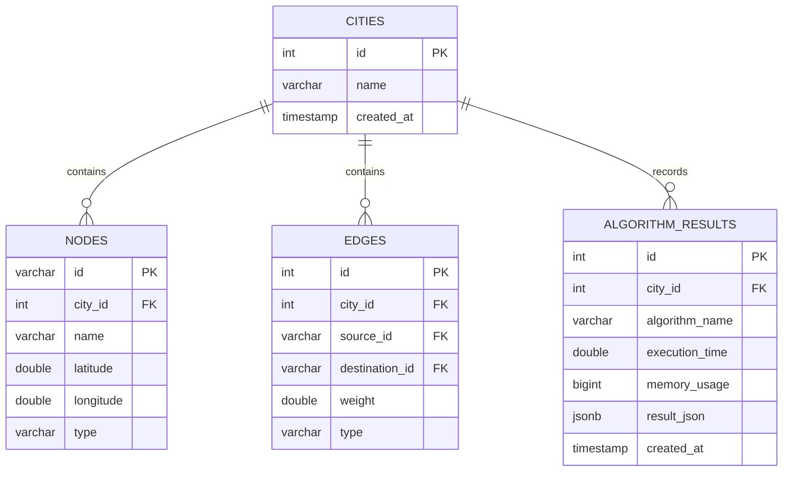

# System Architecture & Design Document

This document outlines the technical design, architectural patterns, concurrency mechanisms, and data flow of the Smart City DSA Simulator Platform.

---

## 1. Architectural Overview

The application utilizes a clean, decoupled full-stack architecture consisting of four main tiers:

```
[ Frontend Client ]  <-- React 18, React Flow, Redux Toolkit (Port 80/5173)
        │
        ▼ (REST / HTTP)
 [ Reverse Proxy ]   <-- Nginx routing static assets and proxying backend queries
        │
        ▼ (Port 8080)
 [ API Web Server ]  <-- Pistache REST framework in C++20 (multithreaded)
        │
        ├─► [ Core Graph Engine ]   <-- Template-based thread-safe Graph<V, E>
        │
        ▼ (libpqxx Connection Pool)
[ Database Storage ] <-- PostgreSQL 15 (Alpine) relational storage
```

---

## 2. Component Design

### 2.1 C++20 Core Graph Engine (`Graph.hpp`)
The core simulator is template-based (`Graph<NodeT, EdgeT>`), allowing insertion of generic structs representing city elements. It is optimized for heavy concurrent access:
- **Reader-Writer Locking (`std::shared_mutex`):** Multiple threads can read (run pathfinders, traversals, analytics) in parallel using `std::shared_lock`. Writing (inserting/deleting nodes or edges) blocks readers using `std::unique_lock`.
- **Memory Optimization:** Uses `std::unordered_map` for $\mathcal{O}(1)$ lookup of nodes and adjacency lists, minimizing pointer indirection overhead.

### 2.2 Database Layer (`Database.cpp`)
Encapsulates all SQL transactions using the modern **Repository Pattern** and PostgreSQL's C++ driver (`libpqxx`):
- Uses prepared parameterized queries to defend against SQL injections.
- Maps entity rows to C++ structures (`CityNode`, `CityEdge`).
- Stores historical run logs as `JSONB` for performance and searchability in Postgres.

### 2.3 React Frontend Dashboard
Constructed using React 18 and TypeScript with modular layers:
- **Redux Toolkit:** Centralized store managing nodes/edges state, active selections, and coordinate mutations. Houses the undo/redo stack.
- **React Query (TanStack):** Handles network fetching and caching of graph metrics, performance aggregates, and list structures.
- **React Flow:** High-performance Canvas renderer utilizing viewport-aware virtualization to support interactive layouts.

---

## 3. Database Schema

The database diagram consists of four core tables:



- **Cascading Deletes:** Deleting a node automatically drops connecting edges, maintaining database integrity.
- **Indexes:** Multi-column indexes on foreign keys (`city_id`) and algorithms (`algorithm_name`) speed up query lookups.
